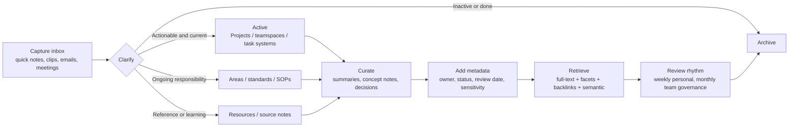

# Structuring and Operating a Knowledge Base

## Executive summary

A durable knowledge base is usually not a single method or a single tool. The most robust pattern is a **stack**: frictionless capture, a shallow top-level structure, disciplined metadata, contextual linking, strong retrieval, and explicit governance. For most personal and team settings, the best starting combination is **GTD for capture and processing**, **PARA for top-level organization**, **atomic or evergreen notes for durable ideas**, and **faceted metadata plus full-text search** for retrieval. Knowledge graphs are valuable, but usually as an **advanced semantic layer** for entity-centric integration, reasoning, or GraphRAG rather than as the first place to write everyday notes. citeturn40search9turn40search1turn41search0turn30search1turn29view2

Under the user’s stated assumptions—**budget, team size, and stack are open-ended**—the highest-confidence recommendation is to design for **portability and governance first**, then optimize for UX. In practice, that means: separate **capture** from **curation**; keep top-level categories few and stable; use metadata fields such as owner, status, project, review date, and sensitivity; treat links as contextual relationships and tags/properties as retrieval handles; and make versioning, access control, and backup/restore explicit, not implicit. citeturn40search3turn29view0turn30search1turn33search0turn26search0turn26search3

A concise technology choice rule works well. Choose **local-first Markdown** when offline work, file ownership, and longevity matter most; choose a **cloud workspace** when collaboration, permissions, and admin controls matter most; choose a **graph database** only when you have a clear semantic model and technical capacity to operate it. citeturn6search1turn7search0turn21search0turn24search19turn36search0turn32search0turn39search0

## Core design model

The strongest general design is a **layered model** rather than a monolithic one. At the bottom is **capture**: quick inboxes, web clipping, meeting capture, mobile notes, and email-to-note flows. Above that is **organization**: a small number of lifecycle-oriented containers such as Projects, Areas, Resources, and Archive. Then comes the **knowledge layer**: curated notes, source summaries, decisions, and concept notes. On top of that sits **retrieval**: full-text search, facets, aliases, backlinks, and optionally semantic search. Finally, there is a **governance layer**: permissions, ownership, review cycles, retention, and restore-tested backups. This layered approach aligns well with GTD’s workflow, PARA’s scope model, faceted-search research, and enterprise governance practice. citeturn40search9turn40search1turn30search1turn25search2turn5search6

A practical implication follows from taxonomy research: do **not** begin with an elaborate hierarchy. Nickerson, Varshney, and Muntermann argue that taxonomy work is often done ad hoc and should instead start from a **meta-characteristic** tied to the purpose of classification. In knowledge-base terms, that means choosing classification dimensions because they support a specific retrieval or governance goal, not because they “seem useful.” For example, “content type,” “confidentiality,” “team owner,” and “project relation” are often better primary dimensions than a sprawling folder tree of topics. citeturn29view0turn43view0

Retrieval research points in the same direction. Marti Hearst’s work on faceted search emphasizes that hierarchies and facets help users explore with lower mental effort, especially when paired with search and visible paths of narrowing. In other words, for most real knowledge bases, **facets beat deep nesting** and **search plus metadata beats folders alone**. citeturn30search1turn30search5

There is also a long intellectual lineage behind linking. Vannevar Bush’s 1945 essay described knowledge access through **associative trails**, a precursor to hyperlinking and modern cross-reference systems. Contemporary knowledge-graph literature extends that intuition with schemas, graph query languages, reasoning, and analytics. The practical lesson is simple: **use both structure and association**. Taxonomy and metadata provide stability; links provide context and serendipity. citeturn27search6turn43view1turn29view2

## Methods and frameworks

The note-structure methods in common use are complementary rather than mutually exclusive. **GTD** is best understood as a workflow discipline for handling inputs and next actions. **PARA** is a simple top-level structure for keeping information close to actionability. **Atomic and evergreen notes** are a writing and synthesis discipline for durable knowledge. **Zettelkasten** is a more opinionated personal system centered on linked thought, synthesis, and writing rather than shared documentation. citeturn40search9turn40search1turn41search0turn27search7

| Method | Core idea | Where it fits best | Main caution | Evidence |
|---|---|---|---|---|
| GTD | Capture, Clarify, Organize, Reflect, Engage | Inbox processing, task triage, weekly review | Weak on enduring reference structure unless paired with another model | citeturn40search9turn40search2 |
| PARA | Projects, Areas, Resources, Archive | Top-level folders, teamspaces, notebooks, drive structure | Too coarse to serve as the only metadata model | citeturn40search1turn40search3turn40search5 |
| Atomic / evergreen notes | One idea per note; concept-oriented; densely linked; evolves over time | Personal synthesis, research, writing, learning | Can become fragmented if overdone or if titles are weak | citeturn41search0turn41search1turn41search11turn41search13 |
| Zettelkasten | Personal web of thoughts emphasizing connection over collection | Scholars, writers, long-horizon research | Usually better for individuals than for canonical team wikis | citeturn27search7turn41search6 |

For a **personal** knowledge base, the best pattern is usually: GTD for intake, PARA for broad placement, and atomic evergreen notes for ideas worth keeping beyond the life of a project. For a **team** knowledge base, direct Zettelkasten-style multi-author editing is usually less effective than a system of **templates, verified/canonical pages, controlled vocabularies, and assigned owners**. Notion’s wiki verification model, Confluence templates, and SharePoint/Microsoft Purview governance features all support this more operational style of shared knowledge management. citeturn19search4turn24search16turn5search6turn25search2

A good compromise is to keep **three note types** distinct. Use **transient notes** for raw capture, **source or working notes** for summaries and project support, and **permanent concept notes** only when an idea is reusable across contexts. Andy Matuschak explicitly recommends a writing inbox for transient notes and separate evergreen notes for concepts that deserve iterative development. citeturn41search4turn41search1turn41search14

## Tool landscape and comparison

The major platforms differ less in whether they can store information and more in **where they sit on three axes**: local-first versus cloud-first, individual thinking versus shared documentation, and lightweight linking versus enterprise governance. Prices below are public list or starting prices when clearly documented; enterprise contracts and regional pricing vary. citeturn6search1turn21search0turn23search0turn18search1turn36search0turn32search0turn32search4

### Personal and workspace tools

| Platform | Indicative cost | Offline support | Collaboration | Linking and graph features | Metadata and tagging | Search and retrieval | Automation and integrations | Security and scalability | Best fit | Evidence |
|---|---|---|---|---|---|---|---|---|---|---|
| **Obsidian** | Core app free; Sync starts at $4/user/month annually; Publish at $8/site/month annually | **Strong** local-first; data stored locally | Shared vaults via Sync, but lighter admin/governance than enterprise suites | Wikilinks, backlinks, graph view, block/header links | Properties, aliases, tags, nested tags | Core full-text search with operators; aliases improve findability | Large plugin ecosystem; CLI; optional Sync/Publish | Local file ownership; no telemetry in core app; Sync uses end-to-end encryption and version history; strongest for individual or small technical teams | Personal KB, research, writing, sovereignty-first knowledge work | citeturn6search1turn7search0turn11search10turn11search3turn11search4turn11search7turn11search8 |
| **Notion** | Free; Plus €9.50/member/month; Business €19.50/member/month; Enterprise custom | **Partial**; desktop/mobile offline with recents and favorites auto-downloaded | **Strong** real-time collaboration, teamspaces, groups | Page links, backlinks, relations; less graph-native than Obsidian/Roam | Rich database properties, status, select/multi-select, wiki verification | Full-text search; Enterprise Search on higher plans; filters and views are a major strength | Public API, webhooks, connections, synced databases, database automations | SAML, SCIM, audit log, advanced controls on higher plans; scalable from personal to enterprise | Shared docs plus lightweight databases and workflows | citeturn21search0turn20search0turn19search1turn19search3turn19search4turn34search4turn20search8turn20search10 |
| **Roam Research** | Public listings show roughly **$15–$19.50/user/month**; verify at checkout | **Partial / cloud-first** | Real-time shared graphs are a core use case | Very strong bidirectional links, block references, outliner model | Pages-as-tags and block structure rather than rich database metadata | Search/filter available; strength is navigational context more than formal metadata | Export appears available via JSON/Markdown; public integration/admin docs are relatively sparse | Publicly documented enterprise admin/security detail is limited in this review; due diligence advised | Networked thought for individuals or small research groups | citeturn16search0turn16search1turn15search1turn16search17turn42search0turn42search2turn15search6 |
| **Evernote** | Free, Starter, Advanced, Enterprise plans | **Yes**, including offline notes on paid tiers | Shared notes, notebooks, and enterprise spaces | Links exist, but not graph-native | Tags, notebooks, spaces, tasks, reminders | Strong search including PDFs, Office docs, handwriting, advanced syntax, and semantic search | Slack, Google, Outlook/Calendar integrations; AI features | 2FA, in-note encryption on desktop, enterprise admin console; scales from personal to enterprise | Capture-heavy workflows and document-centric retrieval | citeturn23search0turn22search5turn22search3turn22search1turn22search8turn22search4turn22search6turn22search11 |
| **OneNote** | Free to use; premium features via Microsoft 365/Office | **Yes**, with cached local copies; local notebooks supported with certain desktop licensing | Shared notebooks via OneDrive/SharePoint; familiar coauthoring model | Primarily hierarchical notebooks/sections/pages; not graph-first | Basic tags and document metadata; weaker structured metadata than Notion/SharePoint | Strong search across notes; migration preserves notebooks, tags, attachments | Outlook, Teams, Loop, Microsoft 365 ecosystem | Uses Microsoft account/M365 permissions and OneDrive/SharePoint sharing controls; scales well for personal, education, and light team use | General-purpose notes, class notebooks, meeting capture inside Microsoft stack | citeturn18search0turn17search6turn17search1turn17search12turn35search0turn35search1turn35search11 |

A concise interpretation: **Obsidian** is strongest when durability, local files, and deep linking matter; **Notion** is strongest when a shared workspace needs structured databases and process visibility; **Evernote** remains strong for capture and document retrieval; **OneNote** is very effective inside Microsoft-centric environments; **Roam** remains influential for block-level networked thought, but buyers should verify current pricing and enterprise-readiness directly because public documentation is less complete than for larger vendors. citeturn6search1turn21search0turn23search0turn18search1turn16search0turn15search6

### Team, enterprise, and semantic platforms

| Platform | Indicative cost | Offline support | Collaboration | Linking and graph features | Metadata and tagging | Search and retrieval | Automation and integrations | Security and scalability | Best fit | Evidence |
|---|---|---|---|---|---|---|---|---|---|---|
| **Confluence** | Free tier + paid cloud plans | **Cloud-first**; offline is not a primary operating model | **Strong** for shared documentation, comments, history, templates | Page links and labels, but not a true graph model | Labels, templates, databases, page properties | Good full-text search with CQL/search syntax | Atlassian automation and Marketplace ecosystem | Space/page permissions; SAML/Guard options; mature admin model | Team wiki, technical docs, process docs | citeturn24search0turn24search1turn24search2turn24search13turn24search16turn24search19turn24search26turn24search9 |
| **SharePoint** | SharePoint Plan 1 starts at $5/user/month annually; also bundled in Microsoft 365 | **Partial**, via OneDrive sync and Files On-Demand | **Very strong** coauthoring, libraries, sites, external sharing controls | Not graph-native, but rich document/library/site relationships | Document properties, library metadata, permissions, sensitivity labels | Microsoft Search, KQL, and semantic indexing in Microsoft 365 | Power Automate, Graph, Microsoft 365 ecosystem | Strong governance, permissions, labels, versioning, large-scale service limits | Enterprise documents, intranet, governed collaborative knowledge | citeturn36search0turn37search0turn37search12turn25search2turn25search5turn25search9turn25search11turn25search1turn36search1 |
| **Neo4j** | AuraDB Free $0; Professional from $65/GB/month; Business Critical from $146/GB/month | **Self-managed or managed cloud**, not a note app | Collaboration happens through apps and APIs rather than wiki-style editing | **True property graph** model; strongest graph-native option in this table | Arbitrary node/relationship properties rather than end-user tagging workflows | Cypher, full-text indexes, vector indexes, path queries | Aura API, importers, GraphQL support, export/import tooling | RBAC, backups, managed and self-managed deployment options, enterprise scale | Entity-centric knowledge graph, GraphRAG, semantic application backend | citeturn32search0turn31search5turn31search9turn38search0turn38search1turn38search2turn38search6turn38search15 |
| **GraphDB** | Free non-commercial license; Enterprise/custom pricing | **Self-managed or managed service**, not a note app | Collaboration is repository- and role-based, not wiki-style | **True RDF knowledge graph** with reasoning and ontologies | RDF vocabularies, schemas, repositories, roles; stronger semantic modeling than end-user folksonomies | SPARQL, full-text search, semantic similarity, reasoning | Connectors for Lucene/Solr/Elasticsearch/OpenSearch, Kafka, MongoDB | RBAC, fine-grained access control, LDAP/OAuth, clustering and backup/restore | Standards-based semantic integration, ontology-rich enterprise KG | citeturn39search18turn39search0turn39search8turn39search1turn39search4turn39search7turn31search14turn32search4 |

The key procurement mistake is to compare these four as if they were substitutes. **Confluence** and **SharePoint** are shared documentation systems. **Neo4j** and **GraphDB** are semantic data platforms. A team frequently needs one from each family: for example, Confluence or SharePoint as the human-facing knowledge hub, with a graph platform only if the organization needs an entity model spanning many systems, controlled vocabularies, or GraphRAG-style retrieval over structured relationships. citeturn24search1turn25search2turn29view2turn39search7

## Operating workflows and governance

A good operating workflow is **Inbox → Clarify → Classify → Curate → Retrieve → Review → Archive**. The key is to minimize friction at capture time and move the thinking cost to scheduled processing time. GTD explicitly distinguishes capture and clarification; PARA provides the placement model; evergreen-note practice provides the curation discipline. citeturn40search9turn40search1turn41search4

For **classification and metadata**, a concise default schema works better than a complex one. A strong baseline is: **title, content type, owner, project/area, status, created date, updated date, next review date, source, and sensitivity/confidentiality**. In a personal vault, some of these can be aliases or properties; in team systems they should become formal fields. The goal is not metadata maximalism but fast filtering, trust, and lifecycle control. Official support for properties/tags/labels exists across Obsidian, Notion, Confluence, SharePoint, and OneNote, though the richness differs significantly. citeturn11search4turn11search3turn19search1turn24search13turn17search22turn5search6

For **linking and knowledge graphs**, the pragmatic rule is: use ordinary page links and backlinks for most knowledge work; introduce a graph database only when you need formal entities, relationships, mappings, reasoning, or advanced semantic retrieval. Property-graph and RDF systems add significant power—path traversal, ontology support, graph analytics, vector search or semantic similarity—but they also add modeling and operational overhead. citeturn29view2turn38search1turn39search4turn39search7

For **versioning**, use the platform’s native history wherever possible, and add an independent recovery mechanism when the knowledge base is important. Obsidian Sync includes version history, Confluence has page history and restoration, SharePoint has version history controls, and Git remains a strong option for file-based Markdown because it records change history and supports distributed copies. Backup policy should include **restore testing**, not just backup creation; the BSI guidance emphasizes that a complete backup concept includes how restoration is performed and tested. citeturn7search0turn24search1turn25search9turn33search0turn33search3turn26search0turn26search6turn26search7

For **access control and governance**, the highest-value pattern in organizations is group-based provisioning at the **space/teamspace/site level**, with page-level exceptions kept rare. Notion supports teamspaces and groups, Confluence supports space and page permissions, SharePoint supports site/library permissions and sensitivity labels, and GraphDB/Neo4j support role-based models in their own domains. Governance should also assign **content owners** and **review cadences**, because stale knowledge is often worse than missing knowledge. citeturn19search3turn24search19turn25search2turn5search6turn31search5turn39search0

## Prioritized best practices and implementation checklists

The most important best practices, in priority order, are these:

- **Adopt one capture inbox and one review rhythm before adding complexity.** This is the foundation for preventing information sprawl and abandoned notes. citeturn40search9turn41search4
- **Keep the top-level structure shallow and lifecycle-based.** PARA or a close equivalent usually outperforms deep topical nesting for both individuals and teams. citeturn40search1turn40search3
- **Standardize a small metadata set and controlled vocabulary.** Taxonomy should follow purpose, not intuition, and facets should support real retrieval or governance tasks. citeturn29view0turn30search1
- **Separate raw capture from durable knowledge.** Meeting notes, web clips, and reading excerpts should not automatically become permanent notes; only curated, reusable ideas should. citeturn41search1turn41search4turn41search7
- **Use links for context, tags/properties for retrieval, and folders/teamspaces for ownership and lifecycle.** Each mechanism serves a different job; problems arise when one is forced to do all three. citeturn11search10turn11search3turn19search3turn24search13
- **Treat sync, backup, and versioning as separate concerns.** Sync moves data; version history enables rollback; backup protects against catastrophic loss; restore tests validate the plan. citeturn7search0turn25search9turn33search0turn26search0
- **Institutionalize governance for team knowledge.** Use owners, verified pages, review dates, access groups, and sensitivity labels. citeturn19search4turn5search6turn25search2

A concise **personal setup checklist**:

- Choose a default architecture: **local-first** if ownership/offline matters most, or **cloud-first** if frictionless sharing matters most. citeturn6search1turn21search0
- Create five top-level containers: **Inbox, Projects, Areas, Resources, Archive**. citeturn40search1
- Define a minimal note template with **title, source, project/area, tags or properties, and next review date**. citeturn11search4turn17search22
- Turn only enduring ideas into **atomic concept notes** with sharp titles and deliberate links. citeturn41search0turn41search12turn41search13
- Enable sync plus rollback, and add an independent backup path such as exports or Git for file-based notes. citeturn7search0turn34search1turn33search0
- Run a **weekly review** and archive inactive material aggressively. citeturn40search9turn40search3

A concise **team setup checklist**:

- Define **spaces/teamspaces/sites** by function, audience, or operating domain—not by every topic imaginable. citeturn19search3turn24search19turn25search2
- Publish templates for **meeting notes, decisions, project pages, SOPs, and source summaries**. citeturn24search16turn19search4
- Standardize metadata fields: **owner, status, tags, last reviewed, sensitivity, canonical/source-of-truth flag**. citeturn19search4turn5search6
- Provision access by **groups**, and reserve item-level exceptions for genuinely sensitive cases. citeturn19search3turn24search19turn25search2
- Turn on version history, export capability, and backup/restore procedures; test restoration on a schedule. citeturn24search1turn25search9turn31search14turn26search0
- Review taxonomy and stale content at least **monthly or quarterly**, and archive aggressively. citeturn29view0turn24search13turn34search1

## Open questions and limitations

Some tool details remain less transparent than others in public documentation. In particular, **Roam Research’s current pricing and enterprise admin/security posture** are less clearly documented than comparable details for Notion, Atlassian, Microsoft, Neo4j, or GraphDB, so direct vendor verification would be prudent before standardizing on it. citeturn16search0turn16search1turn15search6

The comparison also intentionally treats **knowledge graph databases** as a different class from note apps and wiki suites. That is analytically correct, but it means Neo4j and GraphDB belong in a **semantic backend** or advanced integration layer, not as direct replacements for everyday knowledge capture tools. citeturn29view2turn38search1turn39search4